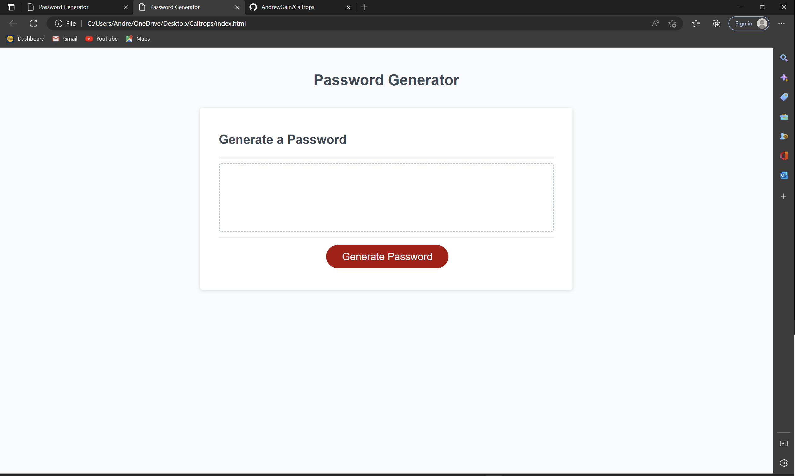

# caltrops

This application was created to help users generate a secure password

The project empasizes the use of javascript to create a random yet secure password for the user

The website is avalible on GitHub to acces it and create your own password you can follow the deployment link or even download the source files and generate your own template so you can get started creating your very own secure passwords

## getting started 

follow the deployment link below to get started

*[GitHub Rpository](https://github.com/AndrewGain/Caltrops)

### prerequisites
to install this applicaton, you will need a text editor. i personally use Visual Studio Code.

### instalation
to install the cod, download the zip file, or you can cloan the repository.

### summary 
* by using HTML and CSS along with Javascript you can create your very own unique secure password
* the point of this is to emphasize how much Javascript can dramaticly change a simple HTML

